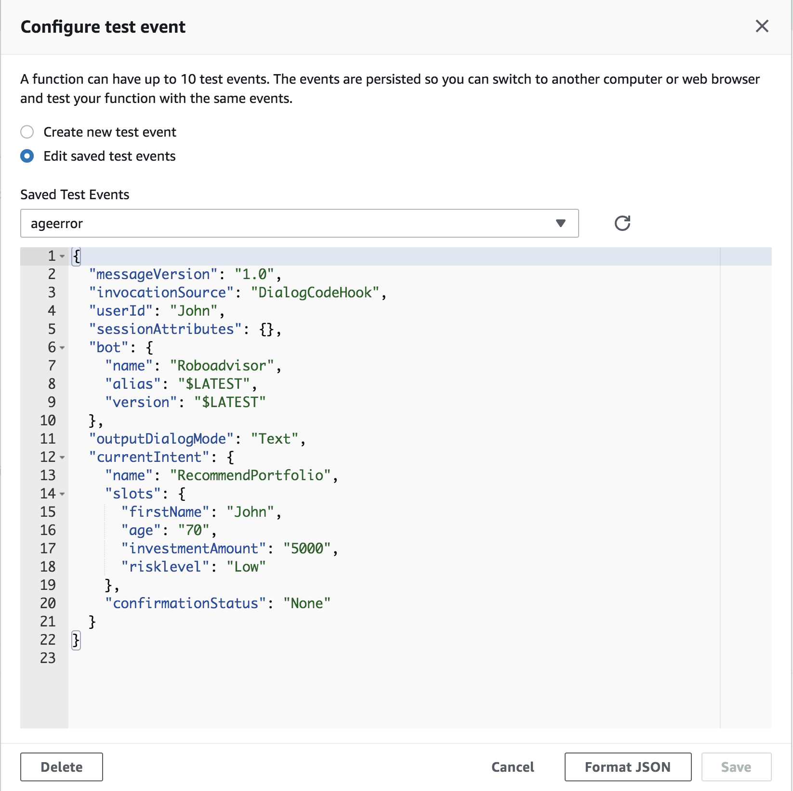
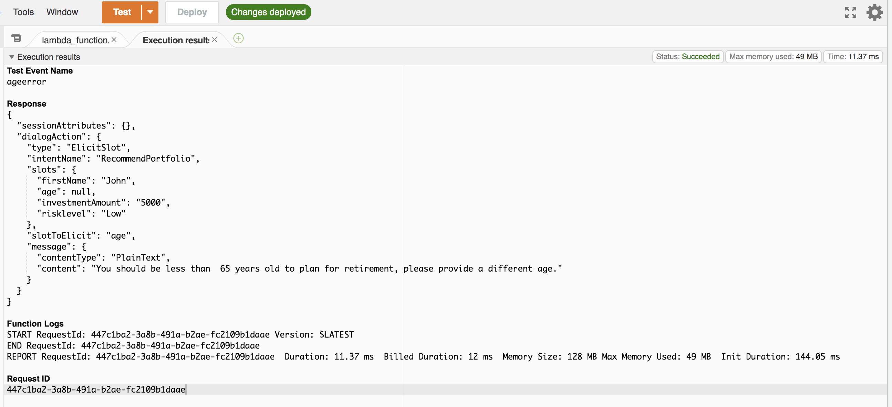
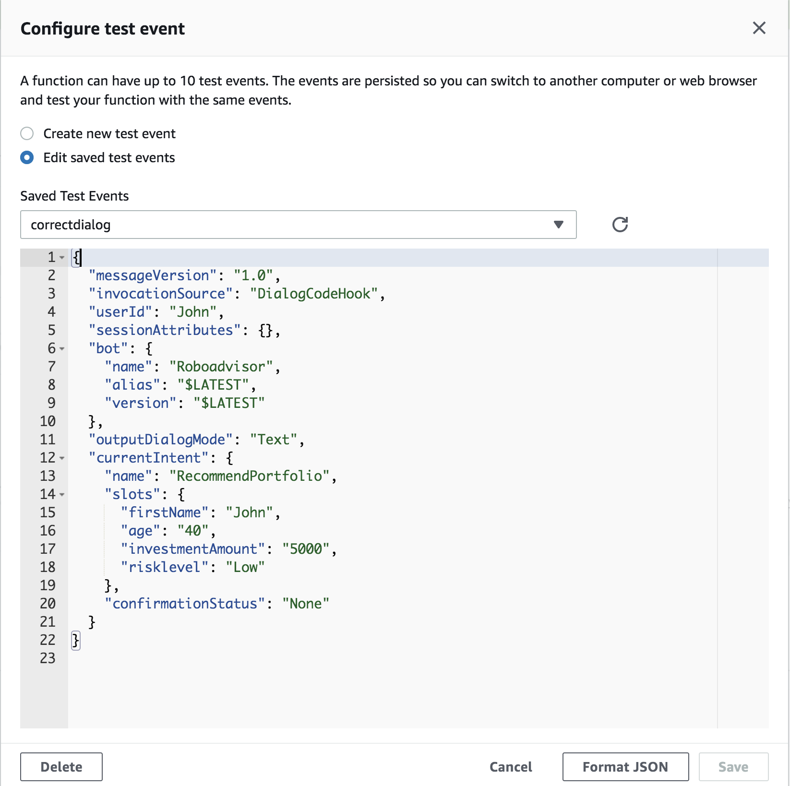
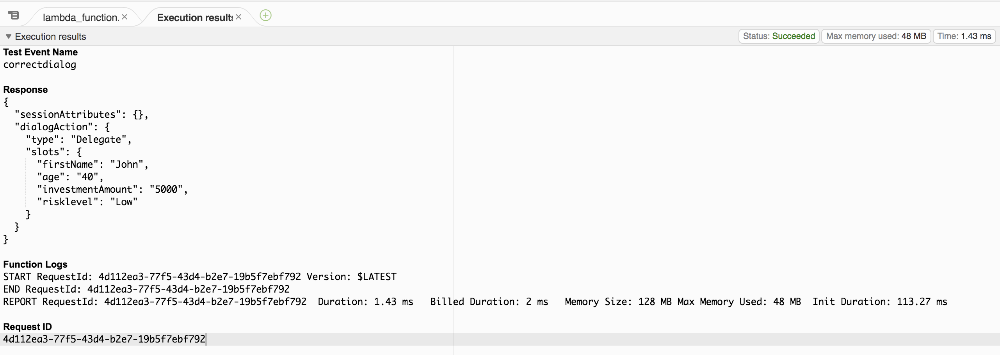
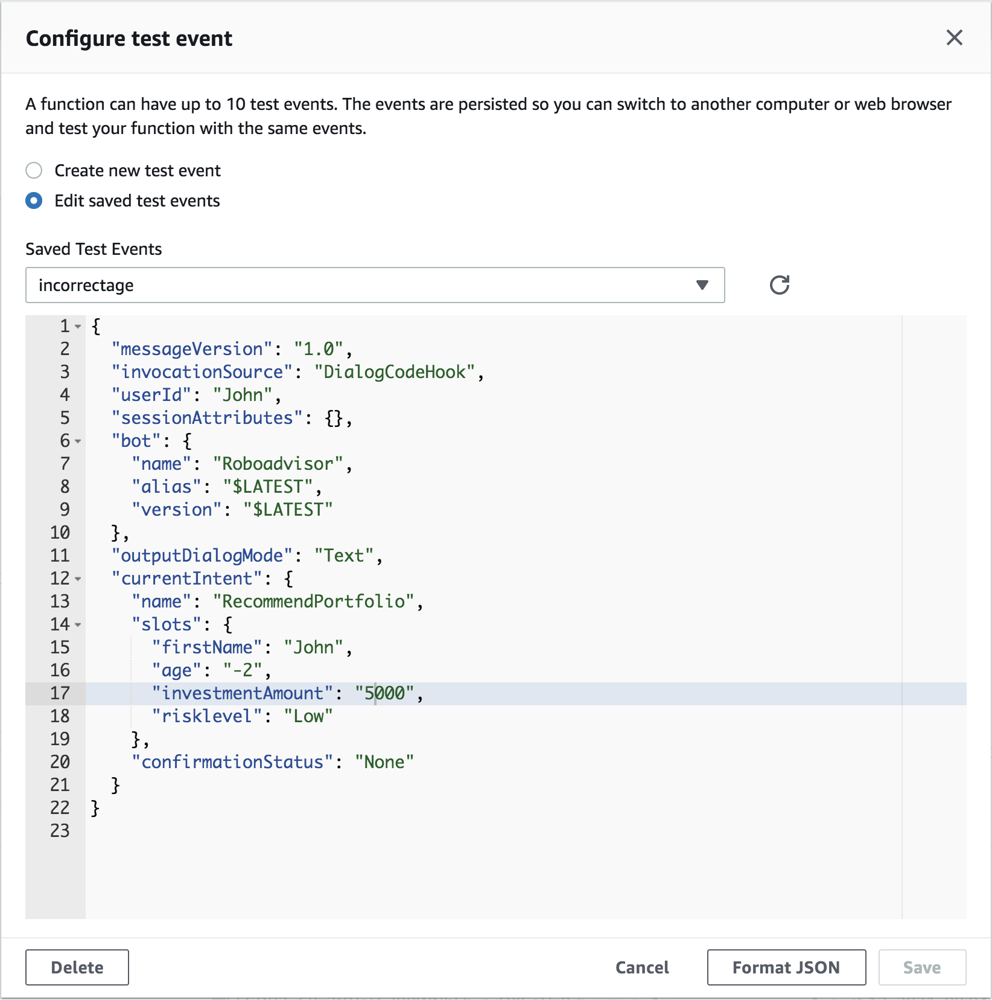
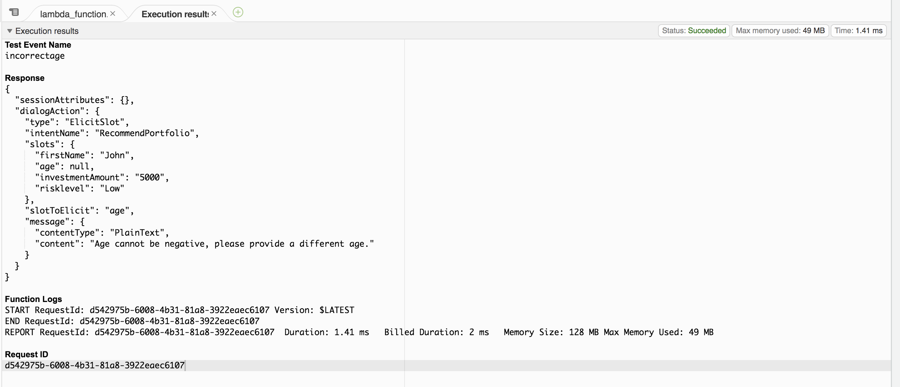
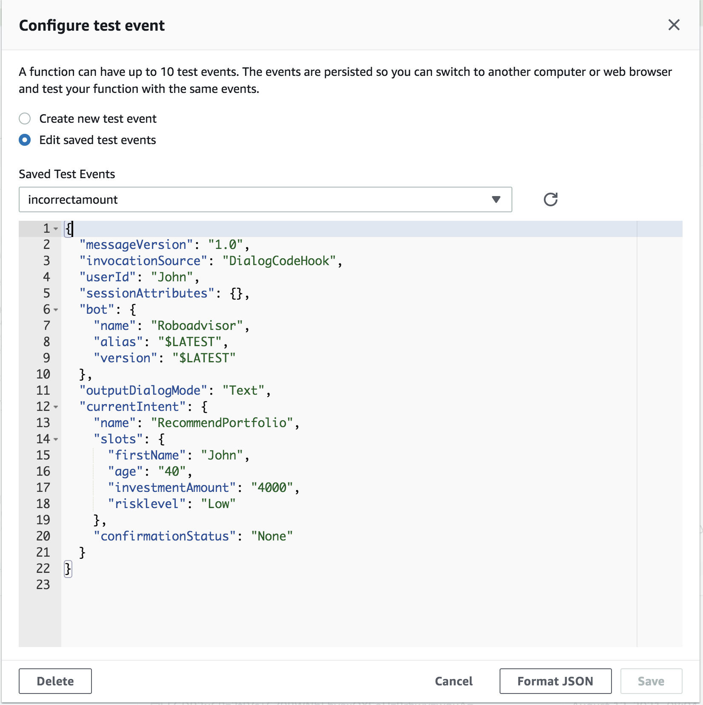
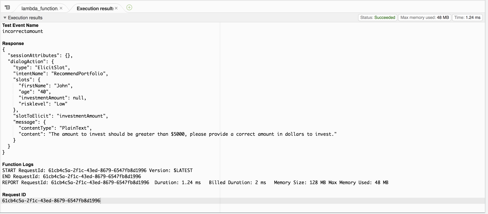
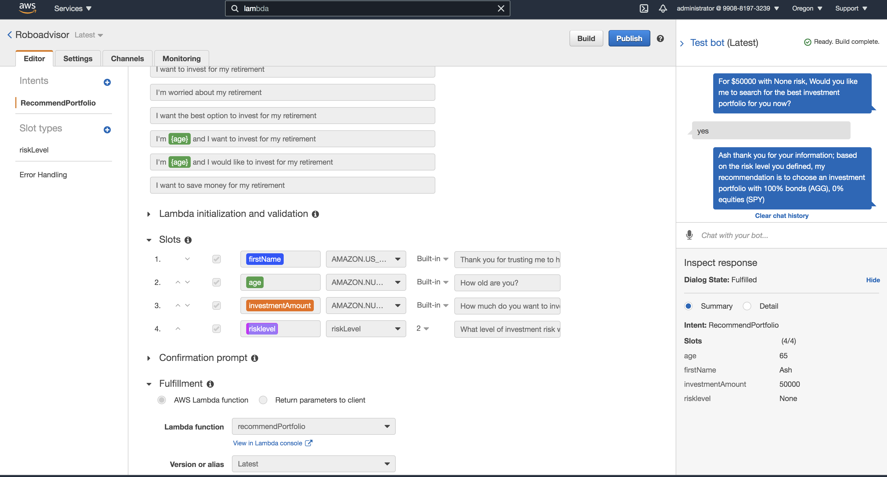

# **Roboadvisor**

---
### **Background**
One of the most prominent retirement plan providers in the country; they want to increase their client portfolio, especially by engaging young people. The company wants to employ machine learning and natural language processing (NLP) to enhance customer experience.

As a part of strategy to engage young people, it has been decided to employ Roboadvisor to recommend investment for retirement portfolio.

---
### **Objective**
To create a robo advisor that recommends user investment portfolio recommendations for retirement based on risk level

---
### **Steps**
1. **Initial Robo Advisor Configuration**
    * Create a Amazon Lex Custom Bot
    * Create RecommendPortfolio intent
    * Define sample utterances
    * Define slot for first name, age, amount to be invested and custom slot for risk level -No, Very Low, Low, Medium, High and Very High risks
    * Add confirmation prompts
2. **Build and Test Bot**
    * Build the bot and test the sample utterances 
3. **Enhance the Robo Advisor with an Amazon Lambda Function**
    * create amazon lambda function using python to validate the user inputs and recommendating the investing portfolio based on the risk level selected by the user.

---
### **Technologies/Tools/Libraries**
1. Amazon Lex
2. Amazon Lamda
3. Amazon S3
4. Python
5. Datetime
6. Dateutil

---
### **Files**
1. [Lambda_function.py](Lambda_function.py)
2. Test Cases
    * [correct_dialog.txt](Test Cases/correct_dialog.txt)
    * [age_error.txt](Test Cases/age_error.txt)
    * [incorrect_amount.txt](Test Cases/incorrect_amount_error.txt)
    * [negative_age_error.txt](Test Cases/negative_age_error.txt)
3. Custom Slot - [risk level](riskLevel_2_c3e67815-b93d-478a-98e2-f45e268f3323_SlotType_LEX_V1.zip)
4. Intent - [RecommendPortfolio](RecommendPortfolio_13_75fe0361-ce73-4050-a262-b6a0cec628aa_Intent_LEX_V1.zip)
5. Amazon Lex Bot - [Roboadvisor](Roboadvisor_1_6008eb72-5231-47af-8a44-a8499b5be43b_Bot_LEX_V1.zip)

---
### **Output**

#### **Test Case Results**
| **Test Case** | **Test Results**|
|-----------|-------------|
| **Age Error** |             |
|||
| **Correct Dialogue** |       |
|||
| **Negative Age** |       |
|||
| **Incorrect Amount** |       |
|||

#### **Roboadvisor Bot**

### **Video Recording**

[Video](Outputs/roboadvisormp4.mp4)
